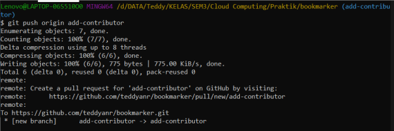

# Git untuk Kolaborasi

## Fork

Fork adalah membuat clone dari suatu repo di GitHub milik upstream author, diletakkan ke milik kontributor. Fork hanya dilakukan sekali saja. Pada dasarnya, proses untuk fork ini meliputi:

1.	Fork repo di web GitHub.
2.	Clone fork tersebut di komputer lokal.

Kontributor harus mem-fork repo upstream author sehingga di repo kontributor muncul repo tersebut. Proses forking ini dijelaskan dengan langkah-langkah berikut:

1.	Login ke GitHub
2.	Akses repo yang akan di-fork
3.	Pada sisi kanan atas, klik Fork:	

4.	Setelah proses, repo dari upstream author sudah berada di account GitHub kita (kontributor)

5.	Setelah proses tersebut, clone di komputer lokal:

Konfigurasikan repo lokal contributor.

1.	origin: menunjuk ke repo milik kontributor di GitHub, hasil dari fork.
2.	upstream: menunjuk ke repo milik upstream author (repo asli)

Repo origin sudah dituliskan konfigurasinya pada saat melakukan proses clone dari repo kontributor. Konfigurasi repo upstream harus dibuat.

Tambahkan remote upstream:

## Mengirimkan Pull Request

### Membuat Perubahan di Repo Lokal

Sebelum melakukan perubahan, pastikan:
1.	Sudah ada koordinasi secara manual tentang perubahan-perubahan yang akan dilakukan.

2.	Setelah melakukan perubahan-perubahan, pastikan bahwa isi repo lokal tersinkronisasi dengan repo dari upstream author.

3.	Cara melakukan sinkronisasi:

4.	Lakukan perubahan-perubahan, setelah itu push ke origin (milik kontributor)

5.	Setelah itu, buka halaman Web dari repo contributor, pilih compare & pull request.

6.	Kemudian isikan deskripsi PR dan klik pada Create pull request:

7.	Pada repo upstream author, muncul angka 1 (artinya jumlahnya 1) pada Pull requests di bagian atas.

8.	Upstream author bisa menyetujui setelah melakukan review: klik pada Pull requests, akan muncul PR dengan message seperti yang ditulis oleh kontributor (Add: contributor). Klik pada PR tersebut, review kemudian klik Merge pull request diikuti dengan Confirm merge. Setelah itu, status akan berubah menjadi Merged.

9.	Sinkronkan semua repo (lokal maupun GitHub kontributor)

