# Instalasi Git

## Windows

1. Setelah download GIT, klik install kemudian akan muncul lisesnsi. Klick Next.

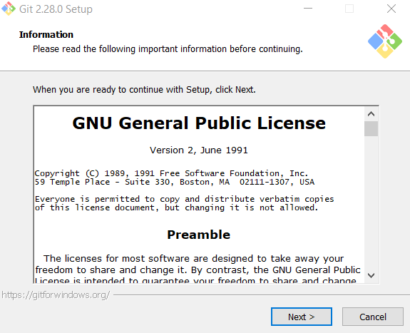{:height="36px" width="36px"}.

2. Kemudian pilih lokasi instalasi, setelah memilih klik Next.

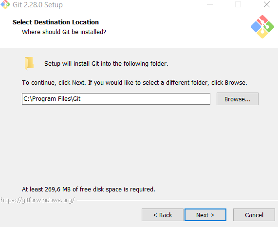

3. Pilih komponen. Tidak perlu diubah-ubah, sesuai dengan default saja. Klik pada Next.

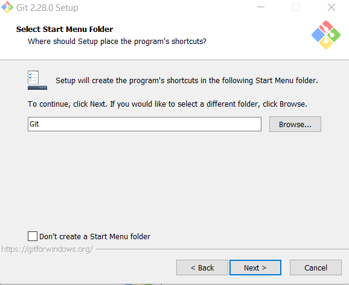

4. Mengisi shotcut di start menu. Setelah selesai klik Net.

5. Pilih editor yang akan digunakan bersama dengan Git. Pada pilihan ini, digunakan Notepad++.

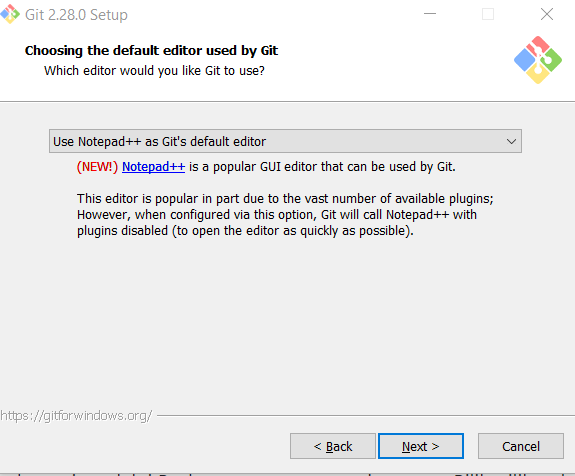

6. Pada saat instalasi, Git menyediakan akses git melalui Bash maupun command prompt. Pilih pilihan kedua supaya bisa menggunakan dari dua antarmuka tersebut. Bash adalah shell di Linux. Dengan memilih pilihan kedua maka kita bisa mengakses GIT dari command promt windows.

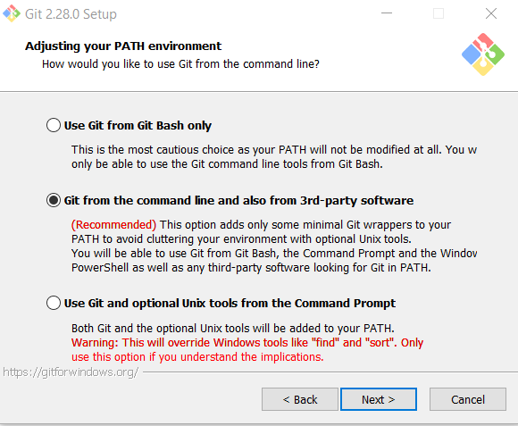

7. Memilih eksejusi SSH. Pilih OpenSSH. Kemudian klik Next.

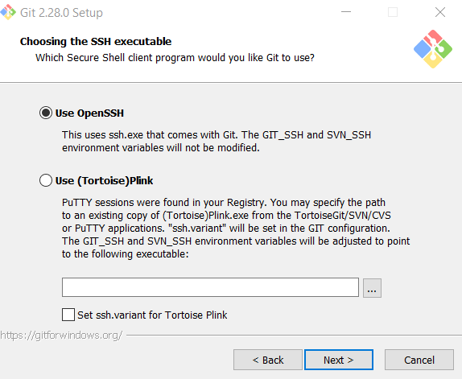

8. Memilih HTTPS transport backend. Pilih Use the OpenSSL library. Klik Next.

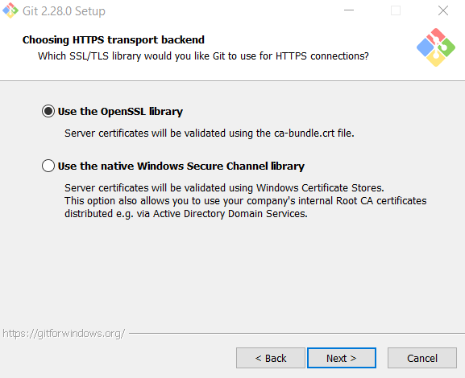

9. Memilih line ending, biasanya bisa diliah saat menggunakan text editor. Setelah selesai klik Next.

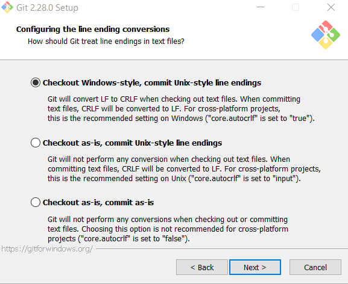

10. Mengkonfigurasi terminal. Pilih use Windows default. Klik Next.

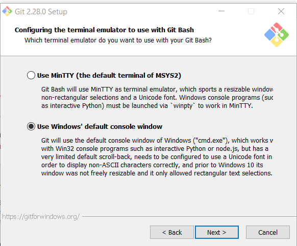

11. Memilih konfigurasi default untuk git pull. Pilih default kemudian klik Next.

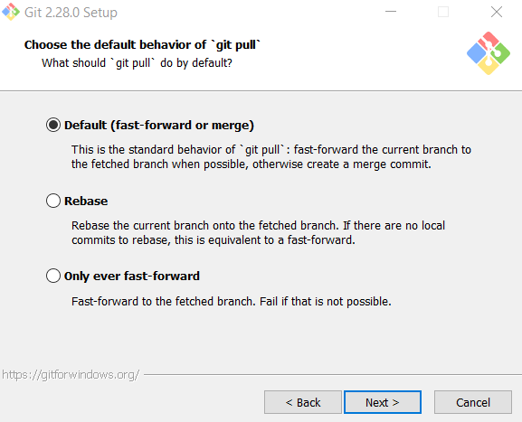

12. Memilih credential manager, kemudian Next.

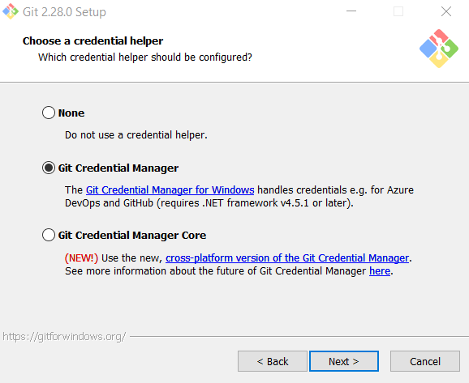

13. Mengaktifkan system caching. Kemudian Next.

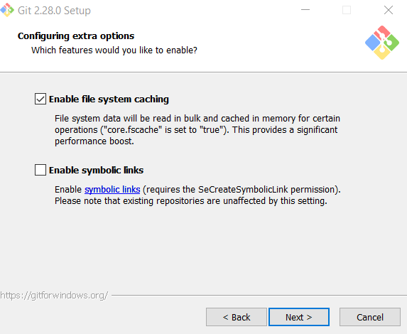

14. Kemudian langsung klik Next.

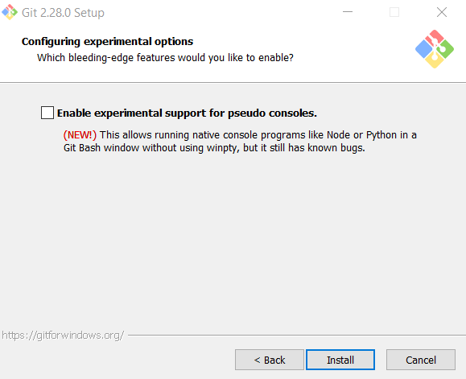

15. Proses instalasi, tunggu sampai selesai proses instalasi.

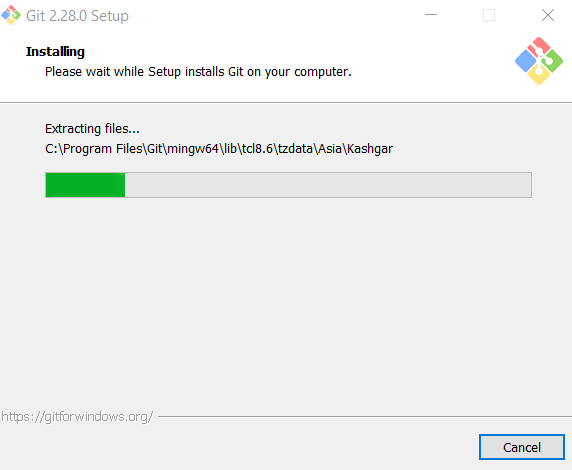

16. Klik Next jika proses installasi telah selesai.

17. Klik start menu kemudian klik bash

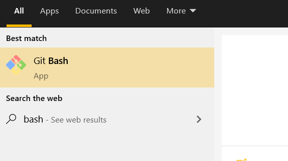

18. Tampilan git bash command

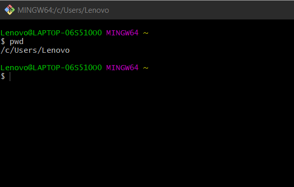

19. Tampilan git GUI.

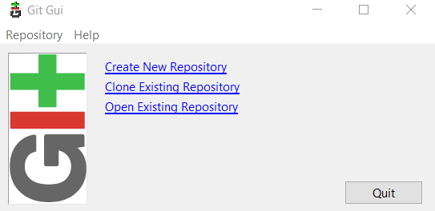

20. Cek apakah git sudah terinstall di computer dengan membuka CMD kemudian mengetikkan git –version.

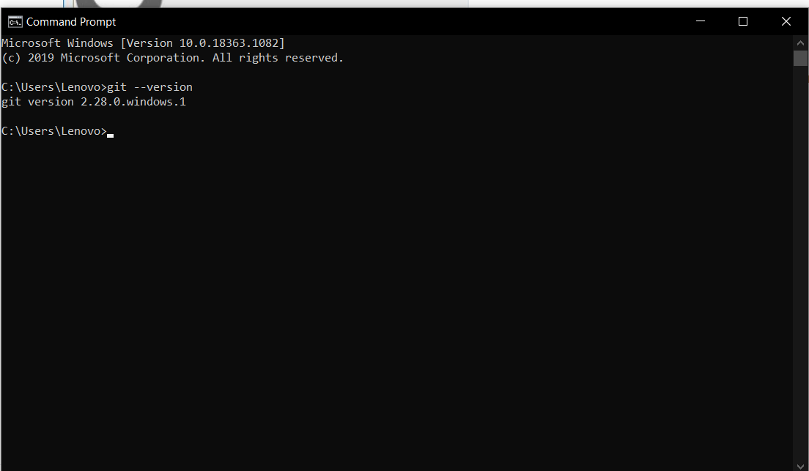
