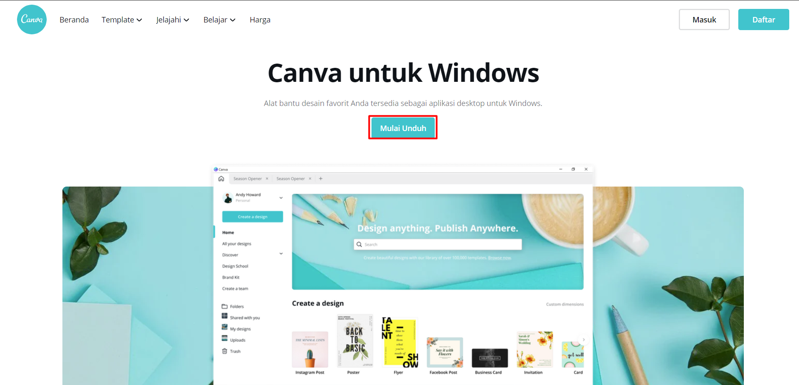
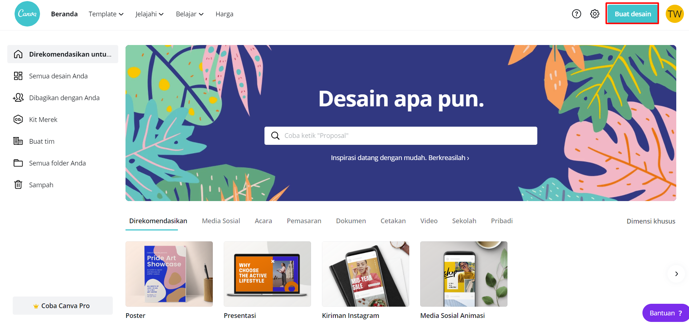
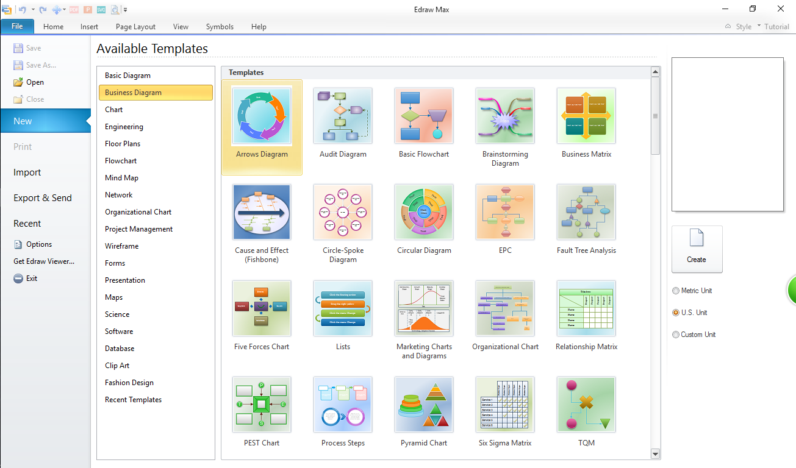
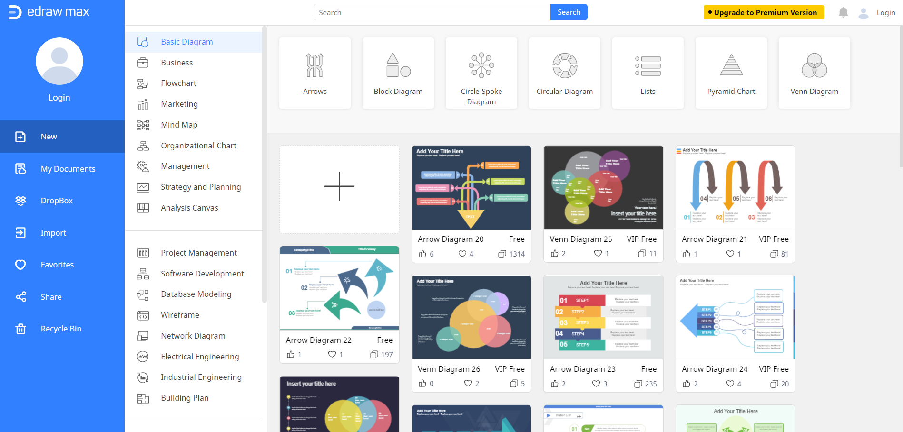

# Layanan SaaS

## Canva

Canva adalah alat yang memungkinkan untuk mendesain apa pun dan menerbitkannya di mana saja. Dengan hanya drag and drop saja pengguna dapat menggunakan ribuan template yang dapat disesuaikan, lebih dari 400 juta desain dari lebih dari 10 juta pengguna di 179 negara sejauh ini telah dibuat dengan Canva.

Canva tersedia dalam 100 bahasa dan dapat diakses di browser desktop dan aplikasi seluler. Hal ini membuat Canva dapat diakses hampir semua orang dengan sambungan Internet.

Dengan Canva, untuk dapat dengan mudah membuat dokumen & desain cantik untuk segala acara dan tujuan. Dari postingan media sosial hingga presentasi, untuk dapat menjelajahi lebih dari 65.000 template yang dapat diedit atau untuk dapat membuat desain untuk sendiri.

Canva juga memudahkan untuk mengakses jutaan stok gambar, ilustrasi, ikon, dan font di dalam aplikasi. Dengan disediakannya media library yang bisa digunakan di semua desain.

juga terdapat sistem untuk menyimpan ydesan yang telah dibuat sehingga pengguna bisa membuka desain yang telah dibuat dimana saja dengna hanya terhubung ke internet, dan bisa dipublikasikan kemana saja.

Jika ingin menggunakan aplikasi Canva pengguna bisa mengunduhnya di [halaman dowbload Canva](https://www.canva.com/id_id/unduh/windows/).

Atau pengguna bisa mengaksesnya secara langsung di browser dengan mengakses [halaman Canva](https://www.canva.com/).

Terdapat juga aplikasi Canva yang bisa digunakan di platform mobile android.

## Edraw MAX

Edraw Max merupakan aplikasi yang dibuat untuk digunakan sebagai alat bantu perancangan, seperti Database, Flowchart, Jaringan, Mindmap dan lain sebagainya. Meskipun ukuran software ini tidak terlalu besar, namun fungsi atau tools yang disajikan sangat lengkap. Selain itu dari segi interface juga tidak kalah dengan Visio yang memang nyaman untuk di lihat. Tidak hanya oleh kalangan mahasiswa, aplikasi ini juga dapat digunakan oleh perancang-perancang professional. Aplikasi ini dapat di download dari situs resminya [Edraw Max](https://www.edrawsoft.com/edraw-max/).

Atau pengguna juga bisa menggunakan Edraw Max secara online dengan masuk ke [halaman Edraw MAX online](https://www.edrawmax.com/online/).

Layanan SaaS lainnya yang memiliki fungsionalitas yang sama antara lain ada [Gravit Designer](https://www.designer.io/en/), [Vectr](https://vectr.com/), [Snappa](https://snappa.com/), dll.