# Getting Started on Heroku with PHP

## Heroku dengan PHP

1.	Check kebutuhan
 

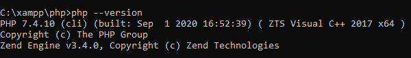

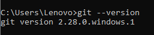

 
2.	Login Heroku 

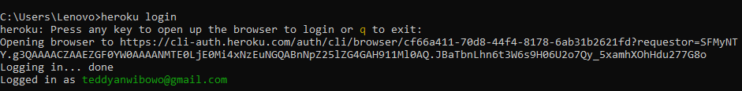

3.	Mempersiapkan APP

 
4.	Deploy App

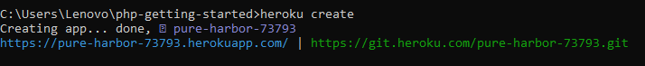

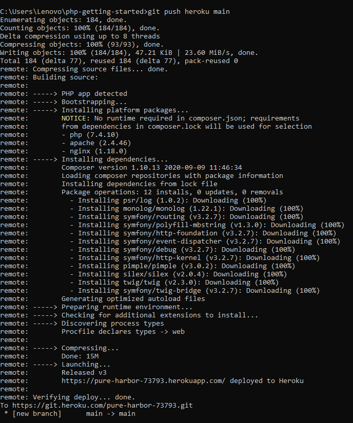

 
5.	Menjalankan aplikasi

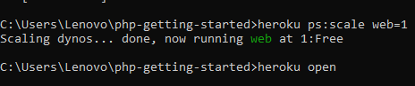

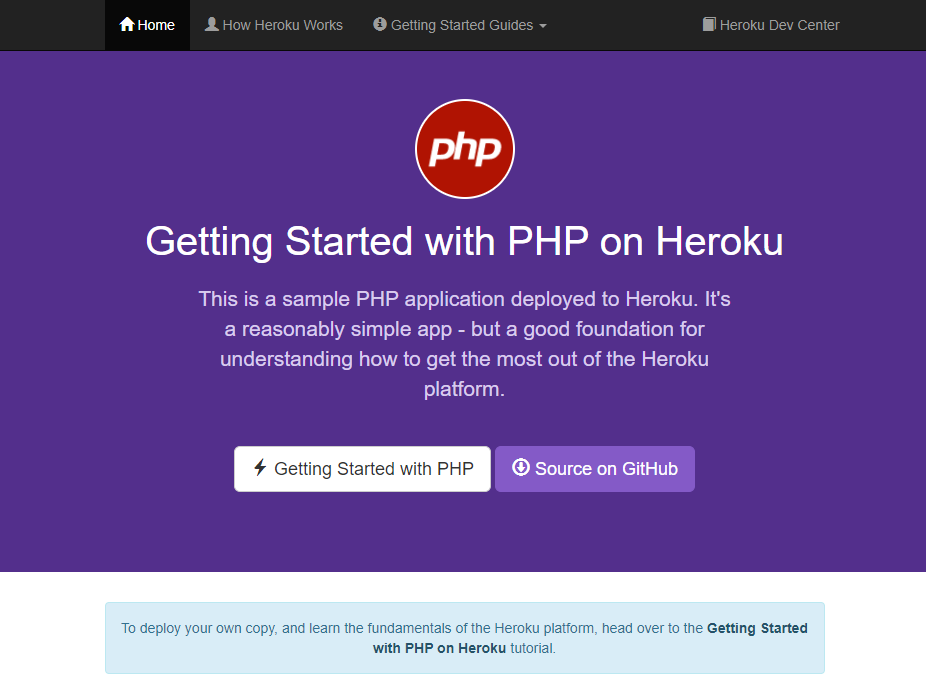

 
6.	Melihat logs

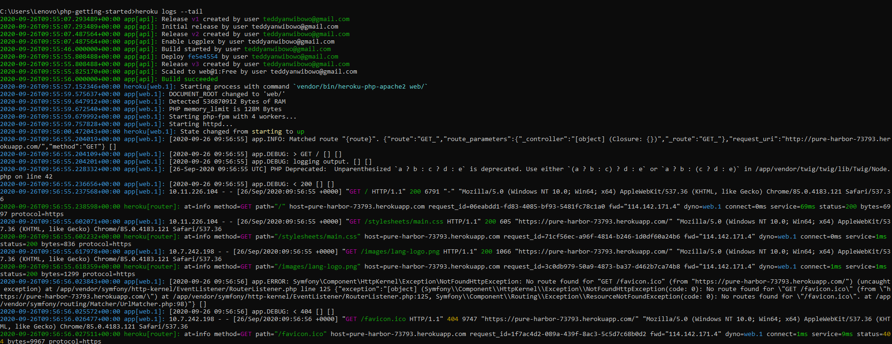

 

## Mendifine procfile

1.	Check berapa banyak dynos yang running

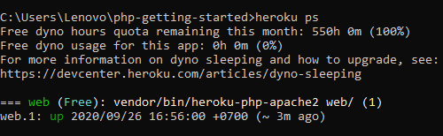

2.	Scaling aplikasi di Heroku 

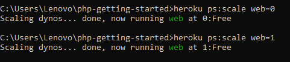

## Declare dependensi dari suatu aplikasi

1.	Install dependensi

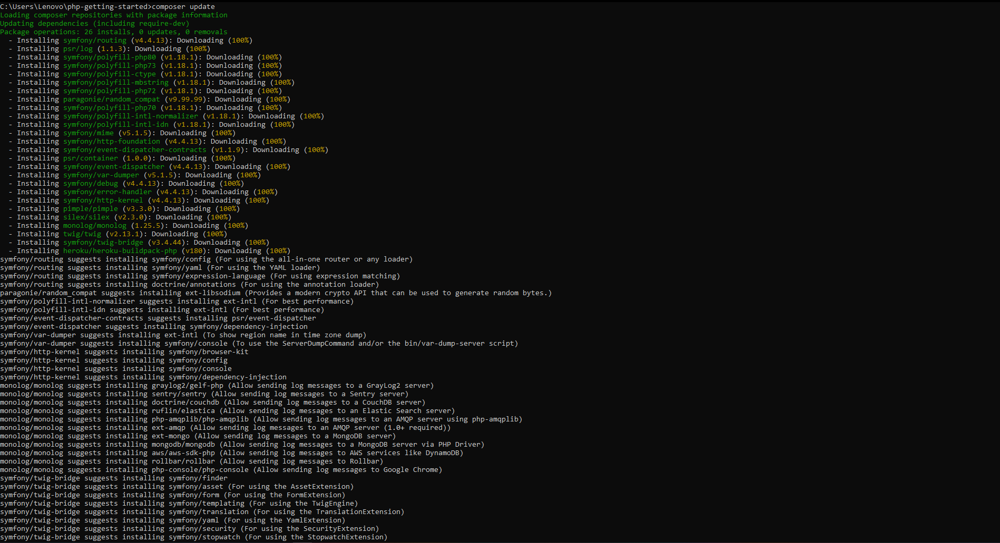

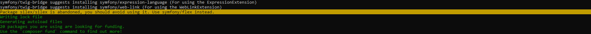

## Melakukan perubahan

1.	Menambahkan dependensi di composer

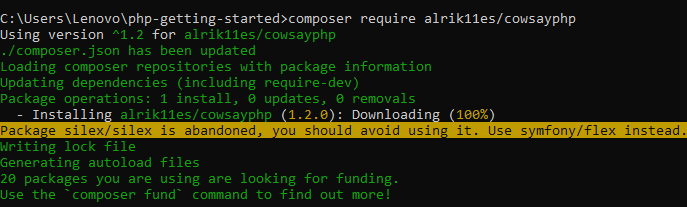

 
2.	Update composer

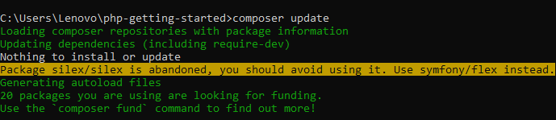

3.	Lakukan perubahan di file index.php

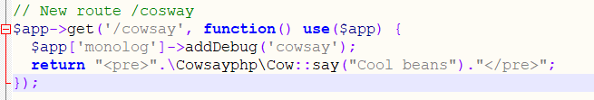

 
4.	Tambahkan perubahan ke git repository

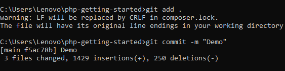
 

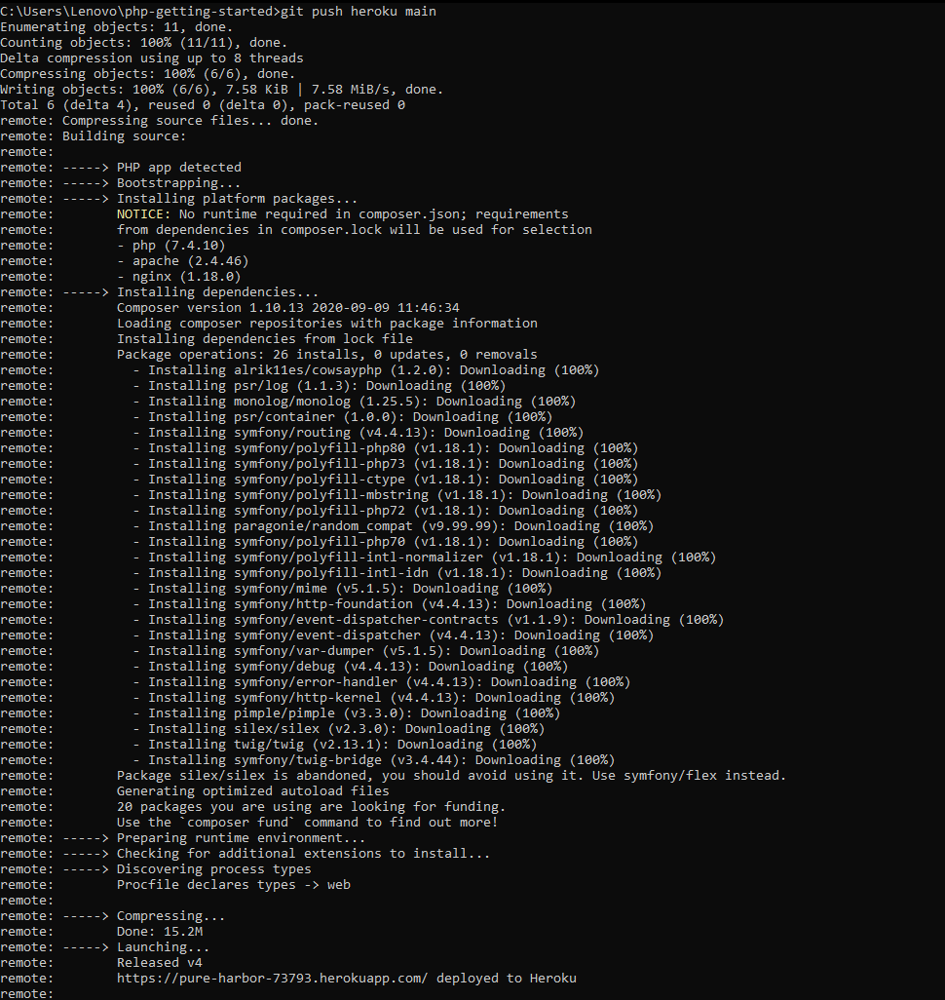

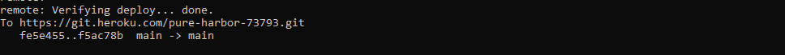

 
5.	Buka app di web yang sudah dilakukan perubahan

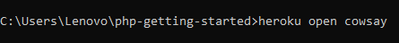

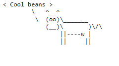

 

## Penyediaan add-on

**NOTE : Untuk add-on diharuskan menggunakan account Heroku yang telah terverifikasi dengan credit card.**

## Memulai dengan tampilan shell
1.	Menjalankan di console, check environment

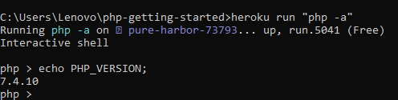

2.	Check file yang ada di dyno

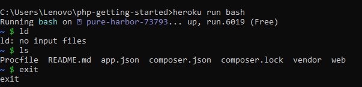

## Define config vars
1.	Modifikasi file index.php

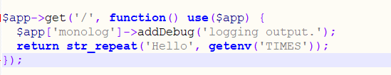

 
2.	Setting config far di Heroku

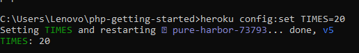

3.	Check config heroku

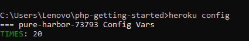

 
 

***Sumber : [Getting Started on Heroku with PHP](https://devcenter.heroku.com/articles/getting-started-with-php?singlepage=true)***