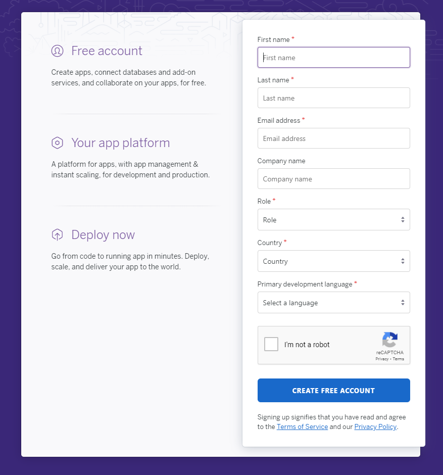
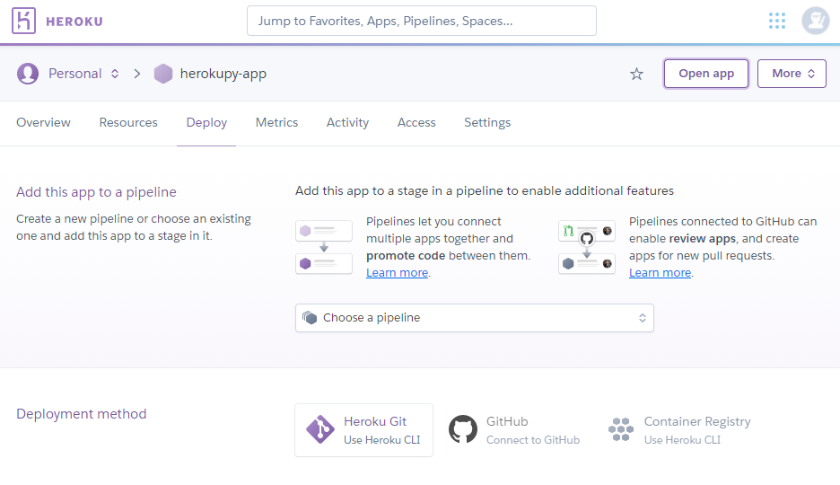
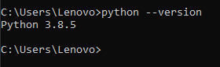

# Getting Started on Heroku with Python

## Persiapan

1.	[Signup ke Heroku](https://signup.heroku.com/).

2.	Buat aplikasi baru melalui dashboard

3.	Install Python

## Getting Started on Heroku with Python

1.	[Download Heroku CLI](https://cli-assets.heroku.com/heroku-x64.exe).
