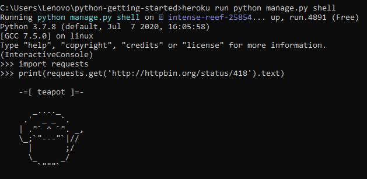

# Getting Started on Heroku with Python

## Persiapan

1.	[Signup ke Heroku](https://signup.heroku.com/).

2.	Buat aplikasi baru melalui dashboard

3.	Install Python

## Getting Started on Heroku with Python

1.	[Download Heroku CLI](https://cli-assets.heroku.com/heroku-x64.exe).

2.	Install Heroku cli

3.	Mempersiapkan APP

4.	Deploy APP

5.	Deploy code yang ada

6.	Aplikasi telah terdeploy, pastikan sudah running

7.	Buka APP yang sudah dibuat

8.	Melihat logs

### Mendifine procfile

1.	Install Python dependencies

2.	Melihat list dependenies

### Declare dependensi dari suatu aplikasi

1.	Check dynous yang running

2.	Scaling aplikasi di Heroku dengan mengganti nomor dynos yang running

### Menjalankan aplikasi secara local

1.	Menjalankan collectstatic untuk menjalankan secara local

2.	Star APP secara local

3.	Buka dengan [http://localhost:5000/](http://localhost:5000/)

### Melakukan perubahan

1.	Melakukan perubahan dengan menambahkan dependencies

2.	Melakukan perubahan di file views.py

3.	Buka Kembali [http://localhost:5000/] (http://localhost:5000/) setelah melakukan perubahan

4.	Menyimpan perubahan ke repository di git

5.	Cek di web aplikasi yang sudah dibuat

### Penyediaan add-on

**NOTE : Untuk add-on diharuskan menggunakan account Heroku yang telah terverifikasi dengan credit card.**

### Menjalankan di console
1.	Menjalankan di console

2.	Check file yang ada di dyno

### Define config vars
1.	Edit views.py

 
2.	Buka Kembali [http://localhost:5000/] (http://localhost:5000/) setelah melakukan perubahan

3.	Setting config var di Heroku 
 

