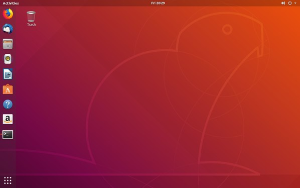
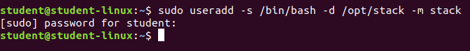
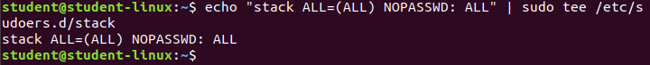
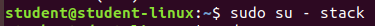
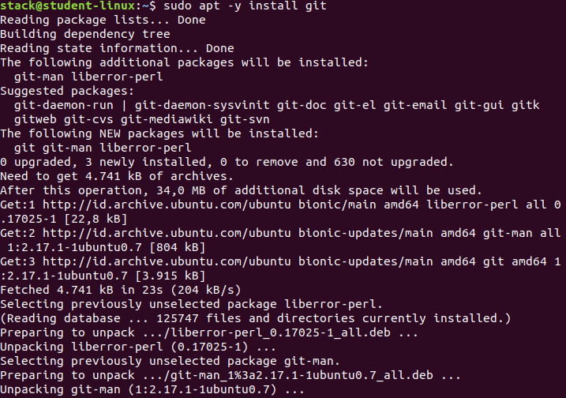
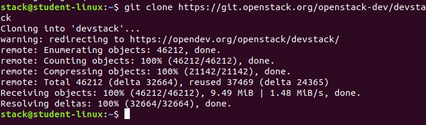
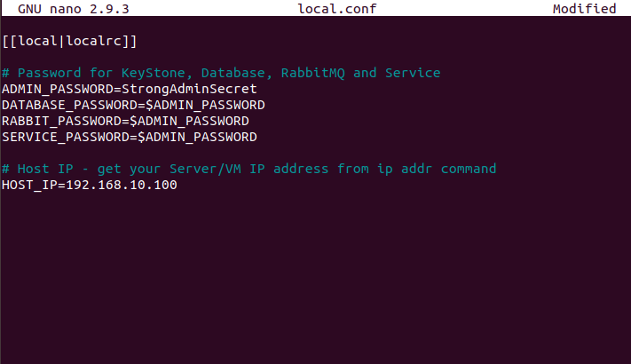
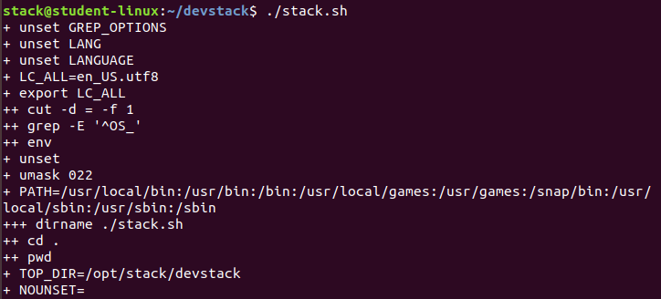

# Installasi DevStack

1. Gunakan [Ubuntu 18.04 (Bionic Beaver)](https://releases.ubuntu.com/18.04/).

2. Lakukan installasi Ubuntu di Virtual Machine.

3. Setelah persiapan selesai, lakukakan installasi DevStack di Ubuntu dengan membuka terminal.

4. Menambah user baru dengan nama stack.

5. Mengaktifkan hak istimewa pada user stack tanpa adanya kata sandi yang digunakan.

6. Pindah ke user stack.

7. Install GIT.

8. Lakukan Clone dari repository DevStack [https://opendev.org/openstack/devstack](https://opendev.org/openstack/devstack).

9. Setelah selesai masuk ke direktori devstack, kemudian lakukan konfigurasi local.conf.

10. Lakukan installasi DevStack.

11. Installasi DevStack telah selesai.

 
 

**Sumber**
 
**[https://docs.openstack.org/devstack/latest/#quick-start](https://docs.openstack.org/devstack/latest/#quick-start)**
 
**[https://computingforgeeks.com/openstack-deployment-on-ubuntu-with-devstack/](https://computingforgeeks.com/openstack-deployment-on-ubuntu-with-devstack/)**