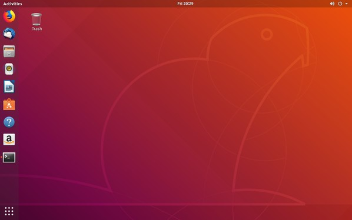

# Installasi Mininet

1. Gunakan [Ubuntu 18.04 (Bionic Beaver)](https://releases.ubuntu.com/18.04/).

2. Lakukan installasi Ubuntu di Virtual Machine.

3. Setelah persiapan selesai, lakukan clone dari [repository Mininet](https://github.com/mininet/mininet).

4. Masuk ke direktori mininet.

5. Melihat tag dari repository Mininet.

6. Berpindah branch.

7. Lakukan installasi Mininet.

8. Installasi Mininet telah selesai.

**Sumber**
 
http://mininet.org/walkthrough