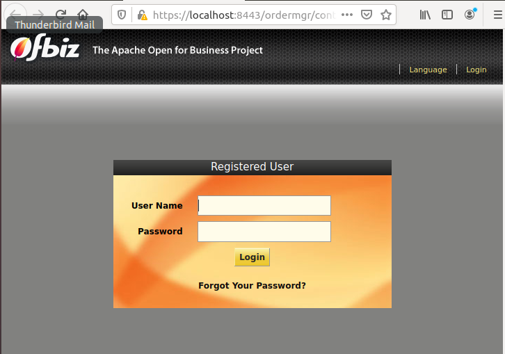

# Installasi Apache OFBiz

1.	Pastikan packet java sudah terinstall di OS.

2.	Download OFBiz, kemudian extract file yang telah didownload.

3.	Installasi OFBiz.

4.	Setelah installasi OFBiz selesai, jalankan service OFBiz.

5.	Membuka OFBiz di Browser. Untuk user/password : <i>admin/ofbiz</i>

 
 

**Sumber**
 
**https://www.techrepublic.com/article/how-to-install-apaches-ofbiz-cms-on-ubuntu-18-04/**
 
**https://ofbiz.apache.org/business-users.html**