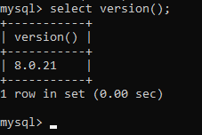

# Install Go, MySQL, dan MongoDB

## Install Go

1.	Download GO Installer
2.	Install GO sesuai gambar dibawah, klik next untuk setiap stepnya. Tunggu hingga proses installasi selesai lalau klik finish.

3.	Chcek version GO

## Install MySQL

1.	Download MySQL Installer
2.	Install MySQL sesuai gambar dibawah, klik next untuk setiap stepnya. Tunggu hingga proses installasi selesai lalau klik finish.

3.	Check version MySQL

## Install MongoDB

1.	Download MongoDB Installer
2.	Install MongoDB sesuai gambar dibawah, klik next untuk setiap stepnya. Tunggu hingga proses installasi selesai lalau klik finish.

3.	Check version MongoDB

## Program untuk mambaca data pada database MySQL dan MongoDB

1.	Pastikan driver MySQL dan MongoDB connector sudah terinstall

2.	Berikut untuk program mengambil data di **MySQL**

sourcecode : [mysql.go](code/mysql.go)

3.	Hasil membaca data dari MySQL menggunakan program

4.	Berikut untuk program mengambil data di **MongoDB**

sourcecode : [mongo.go](code/mongo.go)

5.	Hasil membaca data dari MongoDB menggunakan program

