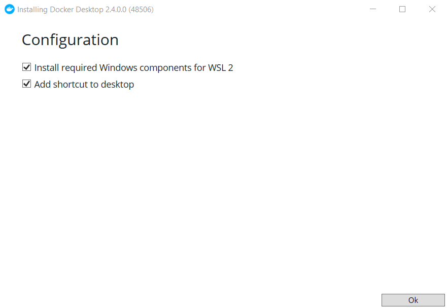
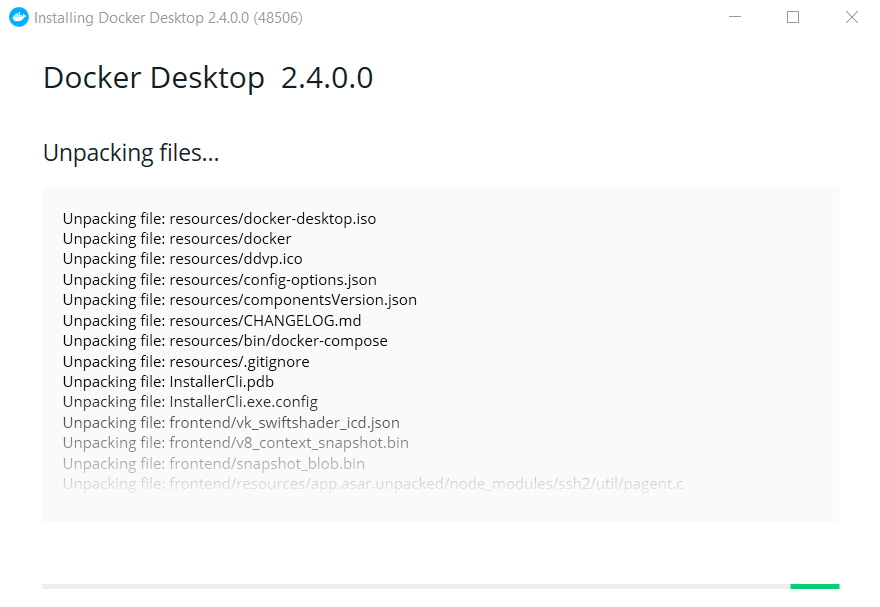
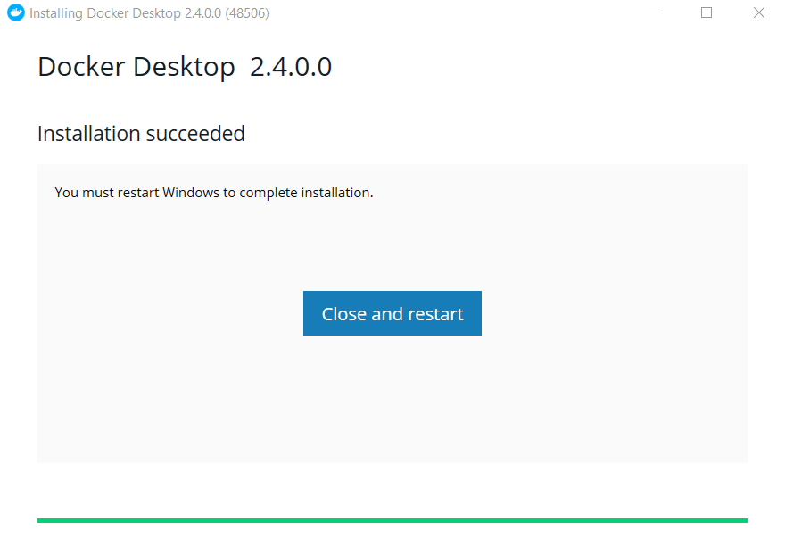
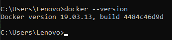
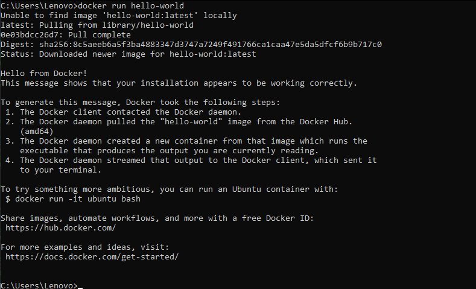
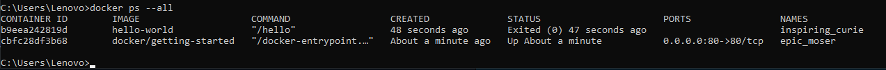

# Install Docker & Getting Started - Docker

## Install Docker

1.	Pastikan sudah download docker melalui link yang telah disediakan. [Docker](https://docs.docker.com/get-docker/).

2.	Install docker seperti gambar

## Getting Started - Docker

1.	Cek versi docker

2.	Menjalankan docker image hello-world

3.	menampilkan seluruh struktur daftar image hello-world

 
 

**Sumber**
 
**https://docs.docker.com/get-started/**