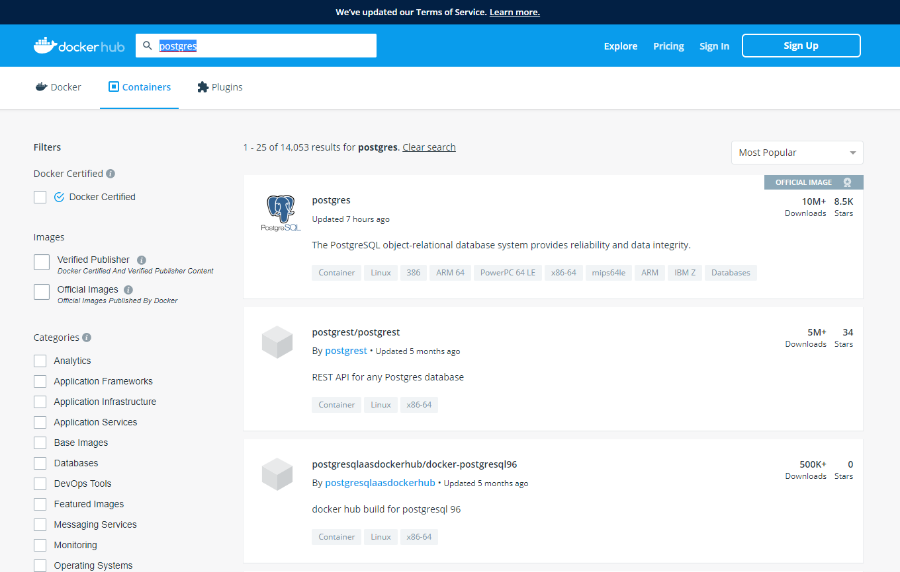
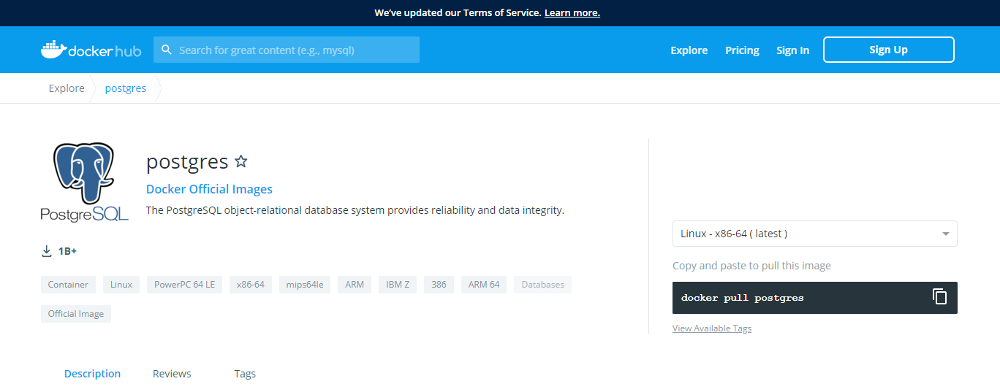
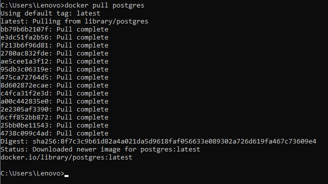
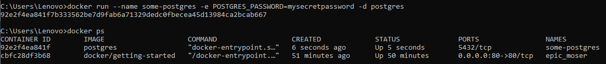
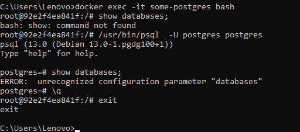

# Image Docker

1.	Disini saya mencari image Dockerhub yaiitu Postgres.

2.	Kemudian pull image Postgres.

3.	Menjalankan postgres dengan docker, dan cek container yang sudah dijalankan.

4.	Masuk ke postgres yang sudah dijalankan.

