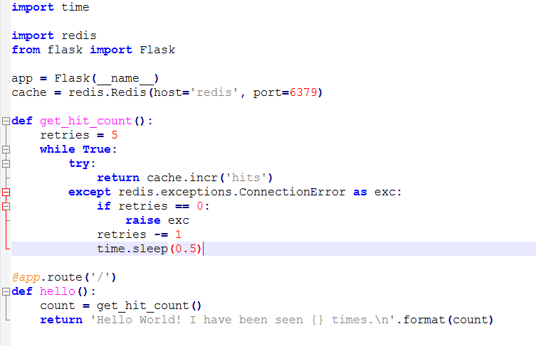

# Getting Started - Docker Compose


1.	Terlebih dulu membuat direktori baru untuk project dan kemudian masuk pada direktori tersebut, seperti pada gambar dibawah ini :

<div align="center"></div>

    ```
    //Membuat folder baru dengan nama composetest
    $ mkdir composetest

    //Berpindah ke folder composetest
    $ cd composetest/
    ```

2.	Selanjutnya membuat file baru pada project dengan nama app.py file python ini akan menghubungkan ke jaringan redis yang nantinya dapat diakses. Dengan menambahkan script seperti pada gambar dibawah ini :

<div align="center"></div>

3.	Kemudian membuat file txt dengan nama requirements dan mengisihkan script pada file tersebut, seperti dibawah ini :

<div align="center"></div>

4.	Kemudian membuat file baru dengan nama DockerFile dan kemudian mengisihkan script seperti dibawah ini :

<div align="center"></div>

<dd>
```markdown 
Pada script diatas tersebut akan berguna untuk mengeksekusi beberapa perintah yang berada pada beberapa file sebelumnya.
```
</dd>

5.	Dan kemudian untuk selanjutnya membuat file yml, dengan nama docker-compose. File ini akan berguna sebagai wadah untuk merujuk pada port 5000 yang nantinya dapat diakses. Seperti pada gambar dibawah ini :

<div align="center"></div>

<dd>
```markdown 
Script diatas merupakan script uang akan menjadi layanan dengan menggunakan port default untuk server web Flask, 5000.
```
</dd>

6.	Melihat file yang ada di direktori composetest

<div align="center"></div>

7.	Kemudian selanjutnya melakukan running untuk project/direktori yang dibuat tadi dengan menggunakan docker compose, yang perintahnya yaitu docker-compose up, seperti pada gambar dibawah ini :

<div align="center"></div>
<div align="center"></div>
<div align="center"></div>

<dd>
```markdown 
Ketika perintah docker-compose up dijalankan maka otomatis sever akan runnig, dimana setiap proses running dilakukan maka akan otomatis merujuk pada image docker dan kemudian merequest ke server redis.
```

8.	Jika di buka pada browser dengan mengakses server host yakni 192.168.99.100:5000. Host ini fungsinya sama seperti penggunaan pada docker dekstop yakni localhost:5000, karena disini saya menggunakan docker tollbox, maka host yang digunakan seperti diatas tersebut.

<div align="center"></div>

9.	Kemudian apabila melakukan refresh pada browser maka secara otomatis akan di count dimana setiap kali request dilakukan maka nilainya akan bertambah, artinya akan menghitung jumlah riquest time dari client. Seperti pada gambar dibawah ini :

<div align="center"></div>

10.	Selanjutnya mengeksekusi perintah untuk melihat daftar image yang ada, dengan meggunakan perintah docker image ls, seperti pada gambar dibawah ini :

<div align="center"></div>

<dd>
```markdown 
Dimana dari gambar diatas repo/image yang digunakan sekarang yaitu python dan redis.
```
</dd>

11.	Kemudian selanjutnya melakukan perubahan pada file .yml yang ada, dengan menambahkan script didalamnya seperti pada gambar dibawah ini :

<div align="center"></div>

<dd>
```markdown 
Dimana perubahan dengan menambahkan dua variabel yaitu volumes dan environtment. 
```
</dd>

12.	Kemudian selanjutnya melakukan running ulang dengan perintah docker-compose up, dan disitu terlihat perubahan, seperti pada gambar dibawah ini :

<div align="center"></div>

	<dd>
	```markdown 
	Dimana hasil update pada file yml akan ditampilkan ketika proses runnig ulang ke host seperti pada gambar diatas tersebut. 
	```
	</dd>

13.	Saat dibuka di browser.

<div align="center"></div>

14.	Kemudian melakukan update pada file app.py dengan merubah pesan seperti pada gambar dibawah ini :

<div align="center"></div>

15.	Perubahan saat dibuka di browser.

<div align="center"></div>

16.	Dan selajutnya melakukan eksperimen pada beberapa perintah docker yang ada. Dimana beberapa perintah ini akan melihat container yang sedang running pada backgroung, melakukan stop running container, melihat running pada server web dan volume container, seperti pada gambar dibawah ini :

<div align="center"></div>
<div align="center"></div>

    ```
	//Menjalankan aplikasi pada latar belakang
    $ docker-compose up -d

    //Melihat aplikasi yang sedang berjalan
    $ docker-compose ps
	
    //Menjalankan dan melihat variabel yang tersedia
    $ docker-compose run web env

    //Menghentikan aplikasi
    $ docker-compose stop

    //Menghapus containers
    $ docker-compose down --volumes
    ```


<br>
<br>

**Sumber**
<br>
**https://docs.docker.com/compose/gettingstarted/**