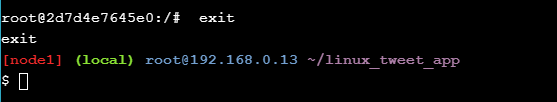
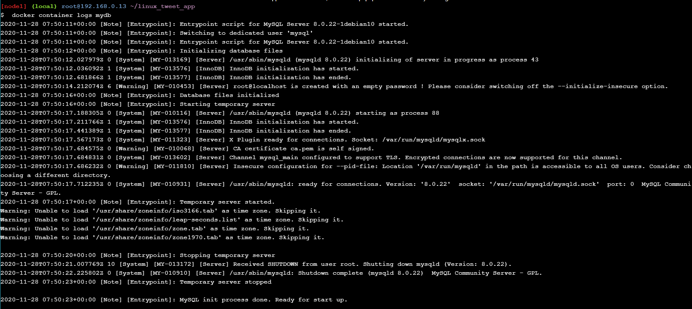
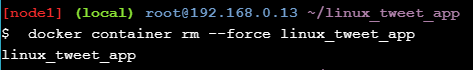

# Docker for Beginners - Linux

1. Pada bagian yang pertama ini, akan melakukan clonning repo dari github dengan mengambil direktori linux_tweet_app. Perintah yang digunakan seperti pada gambar dibawah ini :

2.  Apabila proses clonning berhasil dilakukan, maka langkah selanjutnya akses direktori yang baru di clone dan kemudian jalankan perintah untuk menajalankan hostname melalui linux container yang berapa didalam wadah alphine. Seperti pada gambar dibawah ini :

dari hasil output di atas ini menunjukkan bahwa image alpine:latest terbaru tidak dapat ditemukan secara lokal. Ketika ini terjadi, Docker secara otomatis menariknya dari Docker Hub. sehingga ketika image di pull, nama host kontainer ditampilkan (9ab2cac41e56) seperti pada gambar diatas.

3. Kemudian melihat list container yang tersedia, dengan menggunakan perintah seperti dibawah ini :

dimana seperti yang diberi tanda bahwa cantainer dengan hostname kita sedang running.

4. Kemudian selanjutnya melakukan running container ubuntu dengan menggunakan perintah seperti dibawah ini :

5. Selanjutnya menjalankan perintah seperti dibawah ini didalam container ubuntu :

dimana ls / akan mencantumkan isi direktori root, ps aux akan menunjukkan proses yang berjalan, cat / etc / issue akan menunjukkan proses Linux yang sedang berjalan, dalam hal ini Ubuntu 18.04.3 LTS.
dan kemudian menjalankan perintah exit untuk keluar dari bash container seperti pada gambar dibawah ini :

6. Kemudian selanjutnya menjalankan perintah untuk melihat host yang sedang berjalan, seperti pada gambar dibawah ini :

7. Kemudian mejalankan perintah untuk running container MYSQL, seperti pada gambar dibawah ini :

Sehingga image container mysql akan berjalan pada background.

8. Dan kemudian melakukan cek list untuk container yang sedang berjalan, Seperti pada gambar dibawah ini :

dimanan pada gambar diatas dapat dilihat bahwa container image mysql sedang berjalan.

9. Kemudian melakukan cek terhadap container kita yang sedang berjalan dalam wadah, dengan menggunakan perintah seperti gambar dibawah ini :

10. Selanjutnya melihat container yang sedang berjalan pada wadah dengan perintah seperti dibawah ini :

sehingga dapat dilihat bahwa container mysql sedang barjalan dalam wadah.

11. Kemudian melihat versi container mysql yang sedang berjalan, dengan menggunakan perintah seperti dibawah ini :

12. Selanjutnya melakukan koneksi container docker dengan container mysql yang sedang berjalan dan kemudian melakukan cek versi dengan menggunakan perintah shell baru dalam wadah container ini, dan kemudian menjalankan perintah exit untuk keluar dari wadah container. dengan menggunakan perintah seperti dibawah ini :

13. Membuat situs web sederhana dengan menggunakan image. Pada bagian pertama melakukan check isi dari file Dockerfile, dengan menggunakan perintah seperti dibawah ini :

14. Selanjutnya mengunakan Docker ID kita untuk nantinya bisa membuat image docker baru dan selanjutnya menjalankan perintan docker image build, seperti perintah yang digunakan pada gambar dibawah ini :

15. Dan kemudian menggunakan perintah seperti dibawah ini untuk menjalankan image container docker kita, seperti pada gambar dibawah ini :

apabila proses tersebut berhasil, maka selanjutnya image docker kita dapat diakses di browser, dengan mengklik link seperti gambar dibawah ini :

Sehingga tampilan web sederhana kita dari image docker yang dibuat, seperti pada gambar dibawah ini :

16. Apabila sudah melakukan akses terhadap situs web sederhana kita, maka selanjutnya mencoba untuk menonaktifkan dan remove sementara web kita, dengan menggunakan perintah seperti dibawah ini :

Sehingga apabila kita mengakses ulang web sederhana kita akan menampilkan halaman, seperti pada gambar dibawah ini :

ini dikarenakan image docker yang dibuat menjadi web sederhana tadi sudah dinonaktifkan dan di remove sementara.

17. Kemudian melakukan modifikasi web kita dengan terlebih dahulu menjalankan web sederhana kita kembali, dikarenakan sebelumnya sudah dilakukan nonaktif dan di remove sementara, perintah yang digunakan seperti pada gambar dibawah ini :

18. Kemudian selanjutnya copy file index.html pada container kita, untuk perintahnya seperti pada gambar dibawah ini :

Kemudian lakukan refresh pada halaman web sederhana kita, dan akan menampilkan seperti gambar dibawah ini :

19. Kemudian memberentikan container update kita dan kemudian menjalankan container versi sebelumnya yaitu 1.0. untuk perintahnya seperti pada gambar dibawah ini :

sehingga apabila kita melakukan refresh ulang pada website kita, akan menampilkan halaman pada versi sebelumnya, seperti gambar dibawah ini :

apabila sudah, maka remove dan nonaktifkan sementara kembali web kita. untuk perintahnya seperti dibawah ini :

20. Kemudian melakukan update image. Dengan membuat image baru dengan versinya yaitu 2.0. Perintah yang digunakan seperti pada gambar dibawah ini :

21. Selanjutnya melihat list image yang berjalan, dengan menggunakan perintah seperti dibawah ini :

dimana dari gambar diatas sudah host untuk versi terbaru yang baru saja diupdate yaitu 2.0.

22. Selanjutnya melakukan test untuk versi terbaru image kita, perintah yang digunakan seperti gambar dibawah ini :

dan kemudian tampilan untuk web versi terbaru kita yaitu 2.0, seperti pada gambar dibawah ini :

23. Kemudian apabila kita ingin menjalakan web versi sebelumnya yaitu 1.0, dengan menggunakan perintah seperti dibawah ini :

dan tampilan pada browser ketika di open, seperti pada gambar dibawah ini :

24. Kemudian selanjutnya melakukan push image kita ke docker hub. untuk pertama melihat list image pada docker host kita, untuk perintahnya seperti pada gambar dibawah ini :

dimana terdapat 2 image kita yaitu versio 1.0 dan 2.0, kedua ini akan nantinya di push ke docker hub.

25. Untuk melakukan push ke docker hub, sebelumnya harus melakukan login dengan akun docker kita, untuk perintahnya seperti pada gambar dibawah ini :

login diatas menggunakan ID kita dan Password kita. Apabila sudah melakukan login maka selanjutnya melakukan push image docker kita untuk versi 1.0 dan versi 2.0, dengan menggunakan perintah seperti dibawah ini :

Apabila proses push image docker kita berhasi, maka selanjutnya akses url https://hub.docker.com/u/195411119 . Ini bermaksud untuk melihat dan memastikan hasil image docker yang push tadi, seperti pada gambar dibawah ini :

dimana dari gambar diatas tersebut 2 image docker berhasi di push dan ditampilkan pada container docker saya.

 
 

**Sumber**
 
**https://training.play-with-docker.com/beginner-linux/**