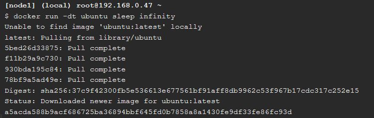

# Docker Networking

## The Docker Network Command

1. Pada bagian yang pertama ini akan menjalankan perintah utama untuk mengonfigurasi dan mengelola jaringan container. Seperti pada gambar dibawah ini :

2.  Kemudian selanjutnya menjalankan perintah untuk melihat jaringan container yang ada pada host Docker saat ini. Seperti pada gambar dibawah ini :

3. Selanjutnnya menggunakan perintah untuk melihat detail konfigurasi dari container jaringan pada docker host saya. Seperti pada gambar dibawah ini :

4. Menjalankan perintah untuk melihat daftar plugin jaringan. Seperti pada gambar dibawah ini :

## Bridge Networking

1. Kemudian melihat jaringan penghubung pada daftar docker host kita saat ini, dengan menggunakan perintah seperti pada gambar dibawah ini :

2. Melakukan instalasi brctl yang nantinya digunakan untuk mendaftar bridges Linux di host Docker. Untuk langkah- langkah perintahnya seperti pada gambar dibawah ini :

3. kemudian setelah itu, menjalankan perintah untuk menampilakan brctl, apakah sudah terdapat bridges yang berjalan pada dcoker host kita, seperti pada gambar dibawah ini :

4. Kemudian menjalankan perintah untuk melihat detail bridges docker0 yang sedang berjalan ketika ditampilkan pada perintah sebelumnya, seperti pada gambar dibawah ini :

5. Selanjutnya membuat container baru. Pembuatan container baru ini berguna untuk dapat terhubung ke jaringan bridges yang ada, untuk perintahnya seperti pada gambar dibawah ini :

6. Kemudian melihat container baru yang dibuat tadi, container baru ini bernama ubuntu:lates, yang merupakan image yang berkondisi sleep tetapi sedang berjalan, untuk perintah dan hasilnya seperti pada gambar dibawah ini :

7. Karena tidak ada jaringan yang ditentukan pada perintah docker run, container secara otomatis akan ditambahkan ke jaringan bridge. Oleh karena itu perlu melihat lagi brctl kita. Seperti pada gambar dibawah ini :

Dari hasil diatas bagaimana bridges docker0 sudah terhubung. Bagian ini menghubungkan bridges docker0 ke container baru yang baru saja dibuat.

8. Kemudian memeriksa ulang jaringan bridges, dengan perintah baru, seperti pada gambar dibawah ini :

9. Dari hasil sebelumnya dimana ip address yang didapatkan pada bridges kita yaitu 172.17.0.2.Selanjutnya kita akan mencoba ping ke ip address tersebut untuk memastikan apakah sedang berjalan atau tidak, seperti pada gambar dibawah ini :

10. Kemudian selanjutnya melihat ID bridges kita, untuk nantinya dapat menghungkan dengan URL lainnya, untuk perintah dan hasilnya seperti pada gambar dibawah ini :

11. Kemudian id container tadi digunakan untuk menjalankan shell pada container ubuntu seperti gambar dibawah ini :

Gambar diatas juga sekaligus melakukan penginstalan program ping.

12. Selanjutnya coba ping ke www.github.com. 

13. Jika sudah selesai kemudian melakukan perintah stop untuk container yang masih berjalan menggunakan ID container yang digunakan sebelumnya.

14. Kemudian memulai container baru dan sekaligus menjalankannya dimana container ini bernama official NGINX. Dimana image ini berjalan pada web server pada port 80. Untuk perintah dan hasilnya seperti pada gambar dibawah ini :

15. Kemudian melakukan cek status container dan port yang sedang berjalan, dari hasil start sebelumnya. Untuk perintah dan hasilnya seperti pada gambar dibawah ini :

16. Menghungkan host docker kita dengan port 80, apabila tidak dapat membukanya pada web browser. Untuk perintah dan hasilnya seperti gambar dibawah ini :

## Overlay Networking

1. Selanjutnya  inisialisasi swarm baru. Untuk perintah dan hasilnya seperti pada gambar dibawah ini :

2. Kemudian menjalankan perintah untuk melihat node swarm yang sedang berjalan, seperti pada gambar dibawah ini :

3. Kemudian membuat overlay jaringan dengan nama overnet. Untuk perintah dan hasilnya seperti pada gambar dibawah ini :

4. Kemudian melihat kembali daftar jaringan pada docker host kita. Untuk perintah dan hasilnya seperti pada gambar dibawah ini :

5. Selanjutnya melihat detail informasi dari jaringan overnet. Untuk perintah dan hasilnya seperti pada gambar dibawah ini :

6. Kemudian membuat layanan baru dengan nama myservice pada jaringan overnet dengan dua bagian. Untuk perintah dan hasilnya seperti pada gambar dibawah ini :

7. Selanjutnya memastikan bahwa layanan yang dibuat dengan dua bagian sudah aktif. Untuk perintah dan hasilnya seperti pada gambar dibawah ini :

8. Selanjutnya memastikan bahwa dua node sedang berjalan. Untuk perintah dan hasilnya seperti pada gambar dibawah ini :

9. Selanjutnya melakukan verifikasi jaringan dua bagian node yang sedang berjalan pada jaringan overnet. Untuk perintah dan hasilnya seperti pada gambar dibawah ini :

10. Melihat detail jaringan overnet dan mendapatkan alamat ip dari running dua node yang ada. Untuk perintah dan hasilnya seperti pada gambar dibawah ini :

## Cleaning Up

1. Selanjutnya melakukan remove layanan myservice. Untuk perintah dan hasilnya seperti pada gambar dibawah ini :

2. Kemudian melihat kembali list jaringan container yang ada. Untuk perintah dan hasilnya seperti pada gambar dibawah ini :

3. Kemudian yang terakhir menghapus node 1 dan 2 yang berjalan pada swarm. Untuk perintah dan hasilnya seperti pada gambar dibawah ini :

 
 

**Sumber**
 
**https://training.play-with-docker.com/docker-networking-hol/**