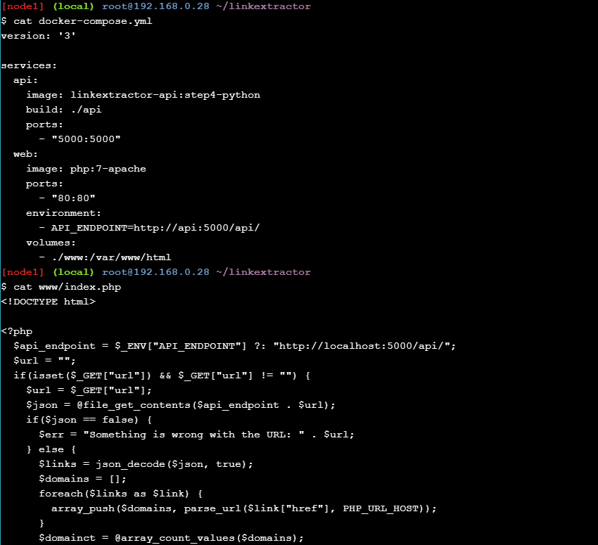
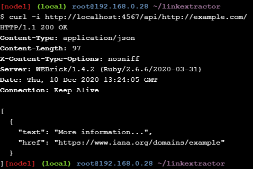

# Application Containerization and Microservice Orchestration

## Stage Setup

1. Melakukan clonning repo dari [linkextractor] (https://github.com/ibnesayeed/linkextractor.git) dan kemudian mengakases derektori serta memeriksa branch dari repo tersebut.

## Basic Link Extractor Script

1. Selanjutnya memeriksa branch step0 untuk melihat file didalamnya. Dan kemudian melihat isi dari file python linkextractor.

2. Selanjutnnya Menajalankan file linkextractor.py.

## Containerized Link Extractor Script

1. Memeriksa branch step1 untuk melihat file didalamnya.

2. Kemudian melihat isi dari file Dockerfile.

3. Membangun docker image. Dimana dengan menjalankan perintah seperti dibawah ini, dan sekaligus manghasilkan outputnya.

4. Kemudian setelah membuat docker image bernama linkextractor: step1 selanjutnya kita mengecek dengan melihat daftar/ist dari image docker yang sudah ada. Kemudian melakukan ekstrak docker image kita dengan mendapat URL.

5. Selanjutnya melakukan percobaan pada halaman web untuk melihat lebih banyak tautannya.

## Link Extractor Module with Full URI and Anchor Text

1. Kemudian memeriksa branch step2 dan daftar file yang ada di dalamnya.

2. Sehingga secara otomatis file linkextractor.py akan diupdate, berikut merupakan hasil update dari file tersebut.

3. Kemudian membuat image baru.

4. Sehingga image docker yang baru dibuat dengan nama linkextractor:step02, kita cek pada pada list image docker yang sudah ada.

5. Kemudian menjalankan image docker tersebut dan menghasilkan keluaran seperti dibawah ini :

6. Kemudian menjalankan image docker step1 yang sebelumnya dan menghasilkan keluaran yang masih sama seperti dibawah ini :

## Link Extractor API Service

1. Selanjutnya memeriksa branch step3 dan isi file didalamnya.

2. Kemudian cek file Dockerfile untuk melihat perubahannya.

3. Selanjutnya melihat isi dari file main.py yang baru ditambahkan tersebut.

4. Kemudian update image docker step3 ini dengan beberapa langkah perubahan, seperti dibawah ini.

5. Selanjutnya menjalankan container dalam mode (-d flag) sehingga terminal dapat tersedia untuk perintah yang lain saat container masih berjalan. Perhatikan juga bahwa disitu terdapat port 5000 dari container dengan host 5000 (menggunakan perintah -p 5000: 5000) agar dapat diakses dari host. Dan juga memberikan nama (--name = linkextractor) ke container untuk lebih mudah melihat log atau menghapus container. Serta melihat list image container yagg baru dibuat tersebut.

6. Membuat permintaan HTTP dalam bentuk /api /url untuk mengakses server ini dan mengambil respons berisi link yang diekstrak.

7. Karena container berjalan dalam mode terpisah, jadi tidak dapat melihat proses yang terjadi di dalam, tetapi dapat melihat log menggunakan linkextractor yang di tetapkan untuk container. Serta menghapus image container ini.

## Link Extractor API and Web Front End Services

1. Selanjutnya memeriksa branch step4 dan isi file didalamnya.

2. Kemudian melihat isi dari file docker-compose.yml dan www / index.php.

3. Membuat mode terpisah untuk container.

4. Memeriksa daftar container yang sedang berjalan serta memastikan bahwa kedua container tersebut benar berjalan. Dan kemudian mengkases layanan API.

Sehingga ketika megkasesnya pada URL, maka hasilnya seperti pada gambar dibawah ini :

5. Selanjutnya memodifikasi file www/index.php mengganti semua kemunculan Link Extractor dengan Super Link Extractor. Kemudian mengembalikan perubahan, dan menonaktifkan container ini.

6. Kemudian memeriksa branch step5 dan melihat isi file didalamnya.

7. Memeriksa file Dockerfile yang baru di dalam direktori www.

8. Selanjutnya, melihat isi file api/main.py dengan menggunakan server redis.

9. Melihat hasil perubahan pada file docker-compose.yml.

10. Selanjutnya melakukan eksekusi container ini, untuk bisa di buka pada browser.

Sehingga hasilnya ketika ditampilkan pada browser, seperti pada gambar dibawah ini :

11. Selanjutnya memeriksa apakah layanan redis dipakai atau tidak.

12. Memeriksa ketika folder www tidak tersedia pada container yang sedang berjalan. kemudian melakukan verifikasi bahwa perubahan yang dibuat secara lokal tidak berada dalam layanan yang berjalan dengan memuat ulang halaman web dan kemudian mengembalikan perubahan. Dan menonaktifkan cointainer ini.

## Link Extractor API and Web Front End Services

1. Kemudian memeriksa branch step6 dan melihat isi file didalamnya.

2. Selanjutnya melihat isi file linkextractor.rb, ini merupakan file ruby untuk mengelola dependency.

3. Kemudian melihat isi file Dockerfile.

4. Kemudian mengecek perubahan pada file docker-compose.yml.

5. Kemudian selanjutnya mengeksekusi container ini.

6. Kemudian selanjutnya harus dapat mengakses API (menggunakan nomor port yang diperbarui):

Sehingga hasil yang ditampilkan pada halaman browser seperti dibawah ini :

7. Kemudian shut down container ini tetapi lognya akan tetap ada walaupun containernya hilang.

 
 

**Sumber**
 
**https://training.play-with-docker.com/microservice-orchestration/**